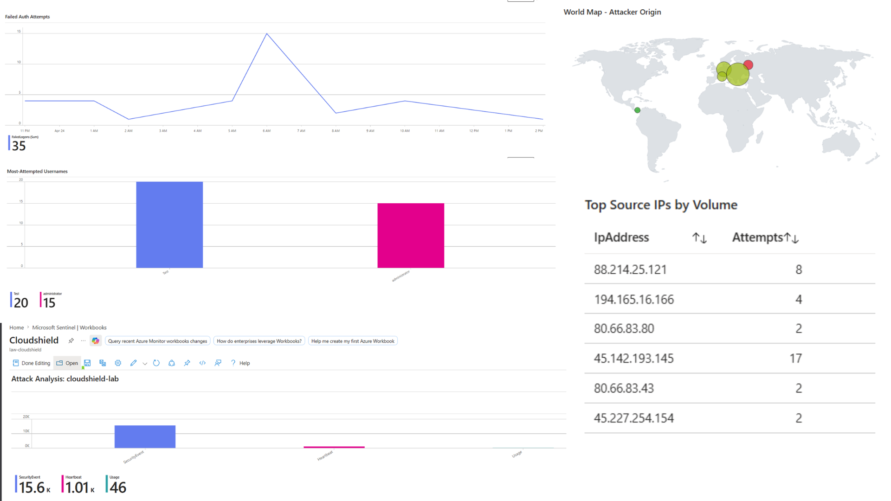
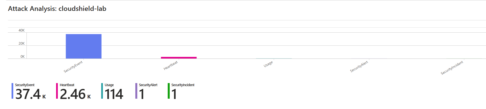
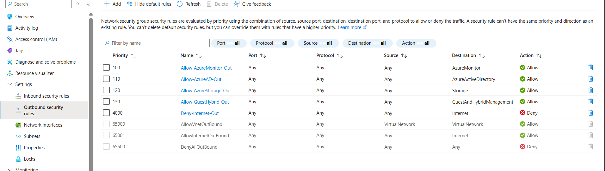
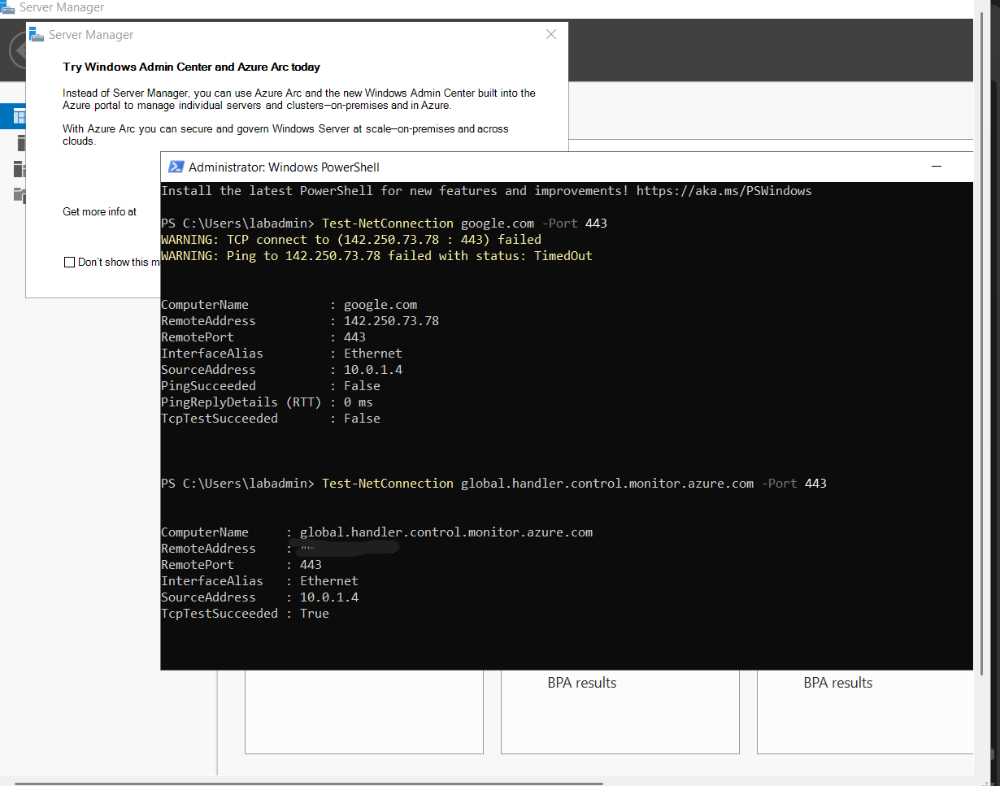
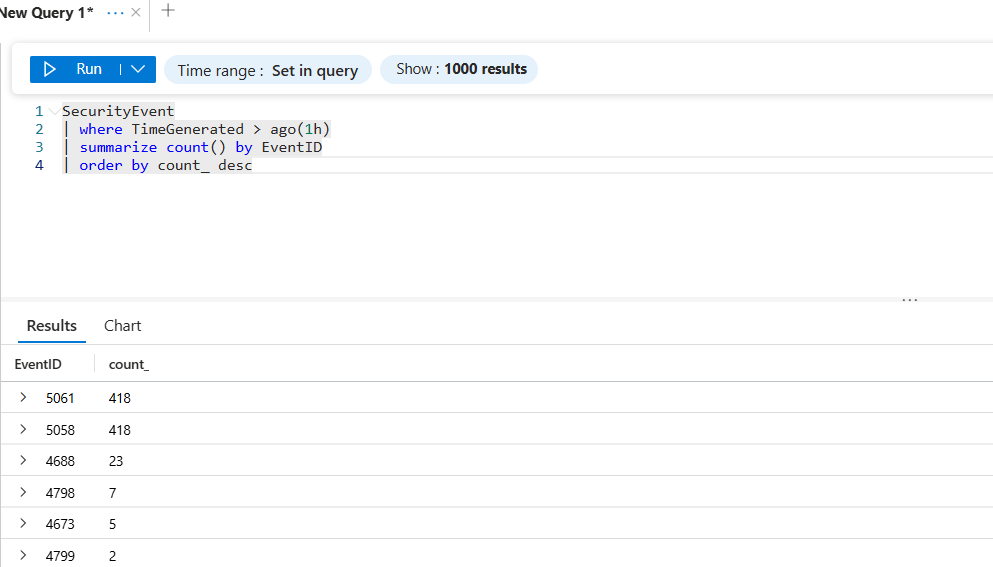

# Azure RDP Honeypot & Detection Engineering Pipeline

An internet-exposed Azure honeypot for capturing real-world attacker telemetry, paired with a detection-as-code pipeline. Raw Windows Security events are forwarded to Microsoft Sentinel, enriched, visualized, and used to author production detection rules mapped to MITRE ATT&CK.

*Note: Some parts of this were inspired by Josh Madakor's project but I have tried to add a very detailed breakdown of how I approached this project and made some changes along the way.*




---

## Project goals

1. Stand up a realistic internet-facing Windows Server target with production-grade safety controls.
2. Capture real, in-the-wild attack telemetry — not synthetic or simulated data.
3. Turn that telemetry into detection engineering artifacts: analytics rules, version-controlled in Git, mapped to MITRE ATT&CK.
4. Publish original threat intelligence from the observations.

---

## Architecture

```
                    ┌─────────────────────────────────────────┐
                    │           Azure Subscription            │
                    │         (cloudshield-lab RG)            │
                    │                                         │
   Internet ───RDP──┼──  ┌──────────────┐                     │
   (attackers)      │    │ cloudshield- │                     │
                    │    │ nsg (NSG)    │                     │
                    │    │  ─ inbound:  │                     │
                    │    │    3389/TCP  │                     │
                    │    │  ─ outbound: │                     │
                    │    │    deny ALL  │                     │
                    │    │    except    │                     │
                    │    │    Azure     │                     │
                    │    │    services  │                     │
                    │    └──────┬───────┘                     │
                    │           │                             │
                    │    ┌──────▼───────┐                     │
                    │    │  web-srv-02  │                     │
                    │    │  Win Srv 2025│                     │
                    │    │  B-series    │                     │
                    │    │              │                     │
                    │    │  Audit policy│                     │
                    │    │  + AMA agent │                     │
                    │    └──────┬───────┘                     │
                    │           │                             │
                    │           ▼ (log shipping)              │
                    │    ┌──────────────┐                     │
                    │    │ Log Analytics│                     │
                    │    │ Workspace    │                     │
                    │    └──────┬───────┘                     │
                    │           │                             │
                    │    ┌──────▼───────┐                     │
                    │    │  Microsoft   │                     │
                    │    │  Sentinel    │                     │
                    │    │  ─ Workbook  │                     │
                    │    │  ─ Analytics │                     │
                    │    └──────────────┘                     │
                    └─────────────────────────────────────────┘

I did use AI to generate this diagram because all the wireframe platforms asked me to sign-up :(
```

---

## Safety controls

Exposing a Windows Server to the internet without compensating controls is a liability. The safety architecture was designed before the VM existed:

| Control | Implementation | Purpose |
|---------|----------------|---------|
| **Egress deny-all** | NSG rule priority 4000, service tag `Internet`, action Deny | Prevents compromise from becoming an outbound attack platform |
| **Explicit egress allows** | Service tags for `AzureMonitor`, `AzureActiveDirectory`, `Storage`, `GuestAndHybridManagement` | Log shipping continues to work |
| **No managed identity** | System-assigned and user-assigned both disabled | Attacker on VM cannot pivot to Azure control plane |
| **Isolated VNet** | Dedicated VNet, single subnet, no peering | Blast radius contained to one subnet |
| **Strong admin password** | 20+ char random, stored in password manager, never typed on VM | No weak-credential foothold by design |
| **Budget alerts** | $15 cap with alerts at 50% / 80% / 100% | Early warning for crypto-miner activity via cost anomaly |
| **Scheduled teardown** | 7-day collection window, then resource group deletion | Limits long-term exposure |



Egress controls were verified end-to-end from inside the VM using `Test-NetConnection` in powershell:

```
Test-NetConnection google.com -Port 443                                                               
Test-NetConnection global.handler.control.monitor.azure.com -Port 443
```

Full safety writeup: [docs/safety-controls.md](docs/safety-controls.md).

---


## Infrastructure deployment

| Resource | Name | Notes |
|----------|------|-------|
| Resource group | `cloudshield-lab` | All project resources scoped here |
| Virtual network | `cloudshield-vnet` | Isolated; no peering |
| Subnet | `cloudshield-set` | `10.0.1.0/24` |
| Network Security Group | `cloudshield-nsg` | 1 inbound allow, 4 outbound allows, 1 outbound deny |
| VM | `web-srv-02` | Windows Server 2022 Datacenter Azure Edition, B-series |
| Log Analytics Workspace | `law-cloudshield` | Pay-as-you-go, pay-per-GB |
| Data Collection Rule | `dcr-honeypot-windows-security` | Forwards Security event log |
| Sentinel | Enabled on `law-cloudshield` | First 31 days free |

Deployment steps documented in [docs/architecture.md](docs/architecture.md).

---

## Telemetry pipeline

Windows Security Event Log → Azure Monitor Agent → Data Collection Rule → Log Analytics → Sentinel.

Audit policy was explicitly enabled on the VM for both success and failure logging of authentication events:

```cmd
auditpol /set /category:"Logon/Logoff"    /success:enable /failure:enable
auditpol /set /category:"Account Logon"   /success:enable /failure:enable
```

Without this step, failed logon events (4625) are not generated - the default Windows audit policy covers Success only for most categories. This was discovered during initial pipeline validation when the SecurityEvent table contained only cryptographic operation events (5061, 5058) and no authentication events.

**Validation query:**

```kql
SecurityEvent
| where TimeGenerated > ago(1h)
| summarize count() by EventID
| order by count_ desc
```




---

## Observations


**Current telemetry:**
- Failed authentication events (4625): **[58]**
- Unique source IPs: **[5]**
- Countries of origin: **[4]**
- Most-attempted usernames: `administrator`, `test`, `web-srv-02`

[Dashboard Analysis](screenshots/sentine-.png) |
[Failed Auth Attemtps](screenshots/sentie-2.png) |
[Most Attempted Usernames](screenshots/sentine-3.png) |
[Top IPs](screenshots/sentine-4.png) |
[World Map](screenshots/sen.png)


Full KQL queries used in the workbook: [docs/kql-queries.md](docs/kql-queries.md).

---

## Detection engineering

Detection rules are authored in KQL for Sentinel in [detection-rules/](detection-rules/).

| Technique | Rule | Severity | Status |
|-----------|------|----------|--------|
| [T1110](https://attack.mitre.org/techniques/T1110/) | [Brute Force - High-Volume Failed Logons](detection-rules/T1110-brute-force-rdp/) | Medium | Deployed |

---

## Project artifacts

- **Detection rules:** [detection-rules/](detection-rules/)
- **Analysis scripts:** [scripts/](scripts/)
- **Screenshots:** [screenshots/](screenshots/)

--- 

## What I learned

1. **Audit policy matters as much as log forwarding.** The telemetry pipeline looked healthy before authentication events were actually being generated - a reminder that end-to-end validation with synthetic events is essential, not optional.
2. **Egress controls are a compensating control, not a nice-to-have.** Exposing RDP without a default-deny outbound rule means the honeypot could be weaponized against others.
3. **Detection thresholds need real data.** The first rule was drafted at `20 attempts / 10 min`. Actual observed volume required tuning to `5 attempts / 1 hour`. This is why rules should be authored against captured telemetry, not theoretical scenarios.