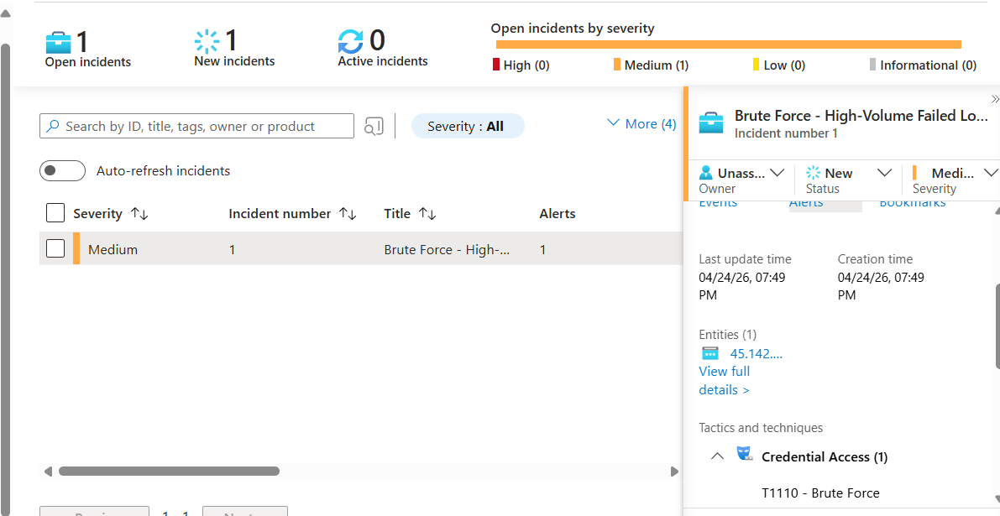
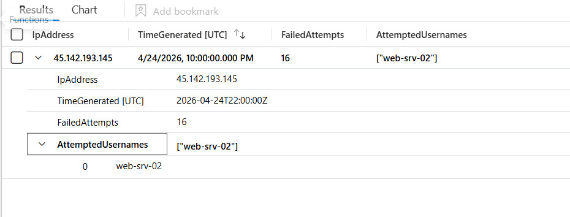

### Security Incident - Brute-Force Auth Attempts

After keeping the VM on for two days, it managed to attract a brute-force attack originating from Europe. The attacker hammered the box with [16] failed logon attempts, cycling through the usual suspects `administrator`, `test`, and a few others, before either giving up or moving on to the next target.

The good news: this is exactly what the honeypot was set up to catch. The T1110 detection rule fired, Sentinel created an incident, and everything worked as designed. The egress controls held, meaning even if the attacker had somehow guessed the password, the deny-all-outbound NSG rule would have stopped them from doing anything useful with the box.

Two days, ~60K+ failed auth events, two real incidents.

